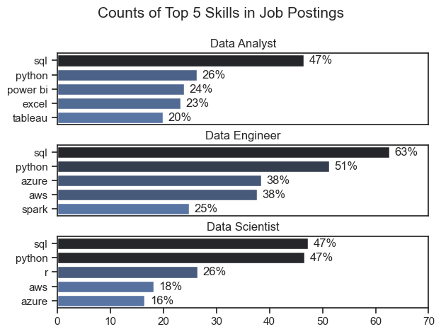
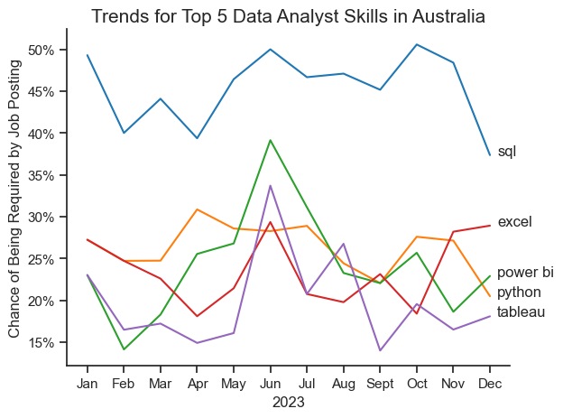

# The Analysis

## 1. What are the most in-demand skills for the top 3 most popular data roles?

I filtered job listings for those that were for 'Data Analyst', 'Data Engineer', and 'Data Scientist' roles. This query showcases the most demanded skills for these three roles, indicating which skills I should focus on developing based on the role I am targeting.

View my notebook with detailed steps here: [2_Skill_Demand.ipynb](scripts/2_Skill_Demand.ipynb)

### Visualise Data

```python
# Create 3 horizontal bar plots showing count of job postings per job title
sns.set_theme(style='ticks')
fig, ax = plt.subplots(len(job_titles), 1)

for i, job_title in enumerate(job_titles):
    df_plot = df_skills_pct[df_skills_pct['job_title_short'] == job_title].head(5)
    # df_plot.plot(kind='barh', ax=ax[i], x='job_skills', y='skills_percent', legend=False, title=job_title)
    sns.barplot(data=df_plot, x='skills_percent', y='job_skills', hue='skills_percent', ax=ax[i], palette='dark:b_r', legend=False)
    ax[i].set_title(job_title)
    ax[i].set_ylabel('')
    ax[i].set_xlabel('')
    ax[i].set_xlim(0, 70)

    if i < len(job_titles) - 1:
        ax[i].set_xticks([])

    for n, v in enumerate(df_plot['skills_percent']):
        ax[i].text(v + 1, n, f'{v:.0f}%', va='center')

fig.suptitle('Counts of Top 5 Skills in Job Postings', fontsize=15)
plt.tight_layout(h_pad=0.5)
plt.show()
```

### Results



### Insights

- SQL is the most in-demand skill across all three data jobs, followed by Python as the second-most in-demand skill across all jobs due to its high versatility. Therefore, prioritising building proficiency in using SQL, followed by Python would be the best approach to target any of these data roles.
- The most common skills requested across Data Analyst job postings focus on those required for basic data access and processing, and creating visualisations. SQL is overwhelmingly the most in-demand skill (47%) followed distantly by Python (26%). There is an emphasis on data visualisation tools such as Power BI and Tableau, which do not appear within the top 5 skills for Data Engineers or Data Scientists.
- The most common skills required for Data Engineers are also related to data access and processing (SQL and Python), as well as cloud platforms such as Azure and large-scale data processing tools like Spark.
- For Data Engineers, both Azure and AWS are equally valued (38%), demonstrating the growing demand for cloud platform experience.
- A very large proportion of Data Engineer jobs request SQL skills (63%), indicating it is extremely important to be highly proficient in SQL if targeting Data Engineer roles.
- Top skills for Data Scientists are similar to Data Engineers. R programming only appears as a top skill for Data Scientists (26%) as it is particularly useful for statistical analysis, although, it is notably less in-demand than Python (47%).
- AWS (18%) and Azure (16%) demonstrate the experience with cloud computing platforms is important for the Data Scientist role.

## 2. How are the top 5 most in-demand skills for data analysts trending?

### Visualise Data

```python
df_plot = df_DA_aus_percent.iloc[:, :5]

sns.lineplot(data=df_plot, dashes=False, palette='tab10')
sns.set_theme(style='ticks')
plt.title('Trends for Top 5 Data Analyst Skills in Australia', fontsize=15)
plt.xlabel('2023')
plt.ylabel('Chance of Being Required by Job Posting')
plt.legend().remove()
sns.despine()

from matplotlib.ticker import PercentFormatter
ax = plt.gca()
ax.yaxis.set_major_formatter(PercentFormatter(decimals=0))

for i in range(df_plot.shape[1]):
    plt.text(x=11.2, y=df_plot.iloc[-1, i], s=df_plot.columns[i])

plt.tight_layout()
plt.show()
```

### Results



### Insights

- SQL is consistently the most in-demand skill throughout the year by a significant margin, hovering between 45%-50%, and demand for SQL remains relatively stable over time compared to the other skills. Therefore, SQL is an essential skill to learn when targeting Data Analyst roles.
- All of these top 5 skills show peak demand around June. This suggests mid-year hiring may favour more technically-diverse candidates.
- Demand for both Power BI and Tableau shows a significant mid-year peak, with lower demand in the early (Jan-Apr) and late months (Sept-Dec). Therefore, if applying for roles around mid-year, it may be more important to showcase projects which use these visualisation tools.
- Demand for Tableau is relatively low, with volatile month-to-month shifts and large spike in June. Therefore, Tableau can be de-prioritised and focus given to the other more in-demand skills.