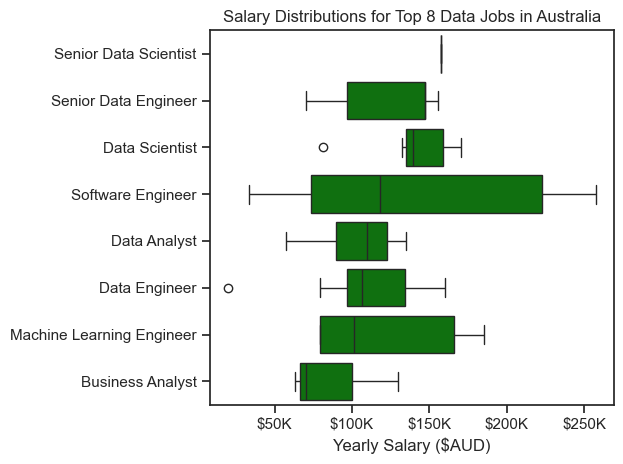
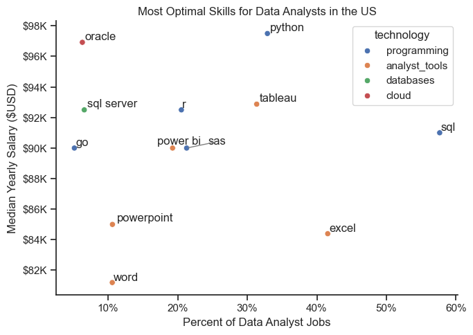

# The Analysis

## 1. What are the most in-demand skills for the top 3 most popular data roles?

I filtered job listings for those that were for 'Data Analyst', 'Data Engineer', and 'Data Scientist' roles. This query showcases the most demanded skills for these three roles, indicating which skills I should focus on developing based on the role I am targeting.

View my notebook with detailed steps here: [2_Skill_Demand.ipynb](scripts/2_Skill_Demand.ipynb)

### Visualise Data

```python
# Create 3 horizontal bar plots showing count of job postings per job title
sns.set_theme(style='ticks')
fig, ax = plt.subplots(len(job_titles), 1)

for i, job_title in enumerate(job_titles):
    df_plot = df_skills_pct[df_skills_pct['job_title_short'] == job_title].head(5)
    # df_plot.plot(kind='barh', ax=ax[i], x='job_skills', y='skills_percent', legend=False, title=job_title)
    sns.barplot(data=df_plot, x='skills_percent', y='job_skills', hue='skills_percent', ax=ax[i], palette='dark:b_r', legend=False)
    ax[i].set_title(job_title)
    ax[i].set_ylabel('')
    ax[i].set_xlabel('')
    ax[i].set_xlim(0, 70)

    if i < len(job_titles) - 1:
        ax[i].set_xticks([])

    for n, v in enumerate(df_plot['skills_percent']):
        ax[i].text(v + 1, n, f'{v:.0f}%', va='center')

fig.suptitle('Counts of Top 5 Skills in Job Postings', fontsize=15)
plt.tight_layout(h_pad=0.5)
plt.show()
```

### Results


### Insights

- SQL is the most in-demand skill across all three data jobs, followed by Python as the second-most in-demand skill across all jobs due to its high versatility. Therefore, prioritising building proficiency in using SQL, followed by Python would be the best approach to target any of these data roles.
- The most common skills requested across Data Analyst job postings focus on those required for basic data access and processing, and creating visualisations. SQL is overwhelmingly the most in-demand skill (47%) followed distantly by Python (26%). There is an emphasis on data visualisation tools such as Power BI and Tableau, which do not appear within the top 5 skills for Data Engineers or Data Scientists.
- The most common skills required for Data Engineers are also related to data access and processing (SQL and Python), as well as cloud platforms such as Azure and large-scale data processing tools like Spark.
- For Data Engineers, both Azure and AWS are equally valued (38%), demonstrating the growing demand for cloud platform experience.
- A very large proportion of Data Engineer jobs request SQL skills (63%), indicating it is extremely important to be highly proficient in SQL if targeting Data Engineer roles.
- Top skills for Data Scientists are similar to Data Engineers. R programming only appears as a top skill for Data Scientists (26%) as it is particularly useful for statistical analysis, although, it is notably less in-demand than Python (47%).
- AWS (18%) and Azure (16%) demonstrate the experience with cloud computing platforms is important for the Data Scientist role.

## 2. How are the top 5 most in-demand skills for data analysts trending?

### Visualise Data

```python
df_plot = df_DA_aus_percent.iloc[:, :5]

sns.lineplot(data=df_plot, dashes=False, palette='tab10')
sns.set_theme(style='ticks')
plt.title('Trends for Top 5 Data Analyst Skills in Australia', fontsize=15)
plt.xlabel('2023')
plt.ylabel('Chance of Being Required by Job Posting')
plt.legend().remove()
sns.despine()

from matplotlib.ticker import PercentFormatter
ax = plt.gca()
ax.yaxis.set_major_formatter(PercentFormatter(decimals=0))

for i in range(df_plot.shape[1]):
    plt.text(x=11.2, y=df_plot.iloc[-1, i], s=df_plot.columns[i])

plt.tight_layout()
plt.show()
```

### Results


### Insights

- SQL is consistently the most in-demand skill throughout the year by a significant margin, hovering between 45%-50%, and demand for SQL remains relatively stable over time compared to the other skills. Therefore, SQL is an essential skill to learn when targeting Data Analyst roles.
- All of these top 5 skills show peak demand around June. This suggests mid-year hiring may favour more technically-diverse candidates.
- Demand for both Power BI and Tableau shows a significant mid-year peak, with lower demand in the early (Jan-Apr) and late months (Sept-Dec). Therefore, if applying for roles around mid-year, it may be more important to showcase projects which use these visualisation tools.
- Demand for Tableau is relatively low, with volatile month-to-month shifts and large spike in June. Therefore, Tableau can be de-prioritised and focus given to the other more in-demand skills.

## 3. How much are each of the most popular data roles paid?

### Visualise Data

```python
sns.boxplot(data=df_top_8, x='salary_year_avg', y='job_title_short', order=job_order, color='green')
sns.set_theme(style='ticks')
plt.title('Salary Distributions for Top 8 Data Jobs in Australia')
plt.xlabel('Yearly Salary ($AUD)')
plt.ylabel('')
ticks_x = plt.FuncFormatter(lambda x, pos: f'${int(x/1000)}K')
plt.gca().xaxis.set_major_formatter(ticks_x)
plt.tight_layout()
plt.show()
```

### Results


### Insights

- There is a significant difference in median yearly salaries between the highest paid role (Senior Data Scientist) and the lowest paid role (Business Analyst), indicating there is high value placed on advanced skills and experience within the industry.
- Salary ranges vary widely between different roles, with Software Engineer roles showing a massive variation in salary. This is due to the wide scope of jobs encompassed by the 'Software Engineer' title, including both Junior and Senior level roles, different responsibilities and specialisations (e.g. backend vs frontend vs cybersecurity e.t.c.). Similarly for the other roles, those with wider salary distributions encompass a wider range of experience levels and different specialisations.
- Very little variation in salary distribution is apparent for Senior Data Scientist Roles. This might indicate that more senior roles are more standardised in salary rates. However, for this role, there were only 5 job postings, so it is likely a coincidence that all 5 postings had very similar salaries.
- Most roles have a right-skewed distribution of salaries, indicating that a large proportion of salaries lies towards the lower end of the distribution, with a smaller number of roles being paid much more than the typical salary. These may be more roles that are niche, require more years of experience, or more demand specialised skills.
- Interestingly, for this data set, Data Analyst roles typically pay more than Data Engineer roles. This is most likely due to the small number of job postings within Australia captured within this dataset for these roles, as Data Engineer roles usually demand more advanced technical skills and experience than Data Analyst roles.

## 4. What is the most optimal skill to learn for Data Analysts?

### Visualise Data

```python
from adjustText import adjust_text

# df_plot.plot(kind='scatter', x='skill_percent', y='median_salary')
plt.figure(figsize=(7, 5))
sns.scatterplot(
    data=df_plot,
    x='skill_percent',
    y='median_salary',
    hue='technology'
)

sns.despine()
sns.set_theme(style='ticks')
plt.title('Most Optimal Skills for Data Analysts in the US')
plt.ylabel('Median Yearly Salary ($USD)')
plt.xlabel('Percent of Data Analyst Jobs')

texts = []
for i, txt in enumerate(df_DA_skills_high_demand.index):
    texts.append(plt.text(df_DA_skills_high_demand['skill_percent'].iloc[i], df_DA_skills_high_demand['median_salary'].iloc[i], txt))

from matplotlib.ticker import PercentFormatter
ax = plt.gca()
ax.yaxis.set_major_formatter(plt.FuncFormatter(lambda y, pos: f'${int(y/1000)}K'))
ax.xaxis.set_major_formatter(PercentFormatter(decimals=0))

adjust_text(
    texts,
    expand_text=(1.2, 1.4),
    expand_points=(1.2, 1.4),
    arrowprops=dict(arrowstyle='-', color='gray', lw=1),
    force_text=1
)

plt.tight_layout()
plt.show()
```

### Results



### Insights

- SQL is the most in-demand skill, appearing in almost 60% of all job postings. It is a foundational skill for landing both junior and senior level jobs, meaning the average salary for this skill is not as high as some more specialised skills. For increasing chances of landing a job as a Data Analyst, SQL should be the number one priority.
- Excel is also required by a large proportion of Data Analyst jobs, and is a good secondary target following building proficiency in SQL in order to maximise chances of securing a Data Analyst job.
- Python is the highest paid skill for Data Analysts in the US. Although there is not as much demand for Python as for SQL or Excel, it is likely the most valuable up-skilling target for Data Analysts in order to increase earning potential.
- Compared to other categories, `programming` tools (colored blue) tend to be found at higher salary levels, indicating learning these skills may come with higher salary benefits for Data Analysts.
- The skills within the `analyst_tools` category are associated with lower salaries. Powerpoint and Word fall under this category, and are associated with both low salary and low demand. Therefore, although still useful, learning these tools should be deprioritised compared to most other tools shown in the visualisation.
- Oracle is the only skill within the `cloud` category. It has a very high associated salary, but is in very low demand compared to other skills, suggesting it might be needed for some niche, specialised, highly paid Data Analyst jobs. It might be worth considering up-skilling in Oracle if working in a field or targeting a field that uses this technology frequently.
